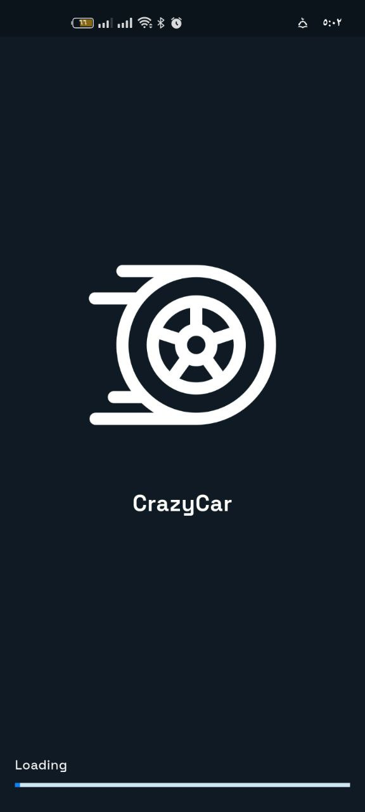
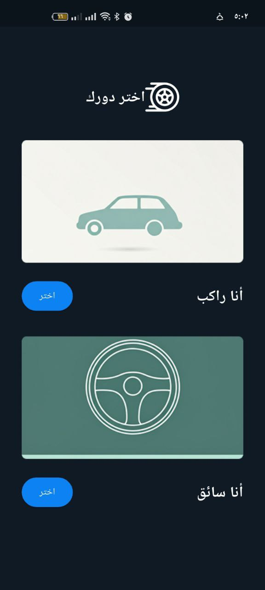

# 🚗 CrazyCar – Smart Ride Sharing App for Drivers & Riders

## 🚀 Project Description

CrazyCar is a modern and user-friendly ride-sharing application that connects drivers with riders in real-time.
Inspired by platforms like Uber, the app allows users to sign up as either a driver or a rider, making it flexible and scalable.

## 🖼️ Pictures from the application

### 🔐 splash page

### 🔐 onboarding page

### 🔐 Login page

## 🛠️ Technologies used

- Flutter
- flutter_screenutil
- easy_localization
- Supabase database and storage
- flutter_dotenv
- BLoC (State Management)
- get_it
- Hive
- hive_flutter
- hive_generator
- shared_preferences

